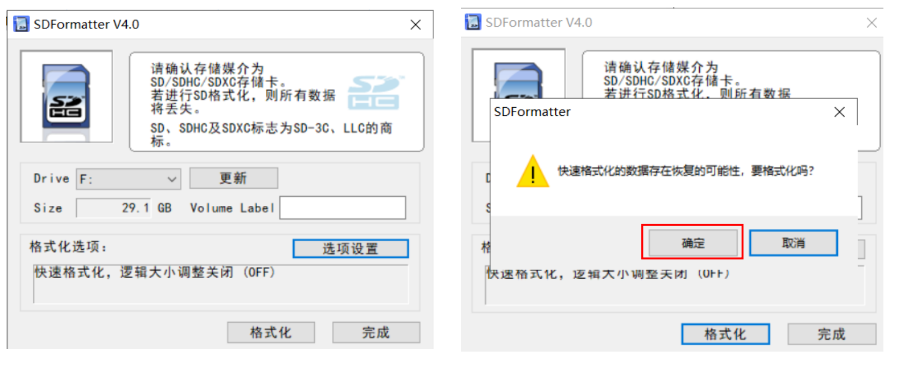
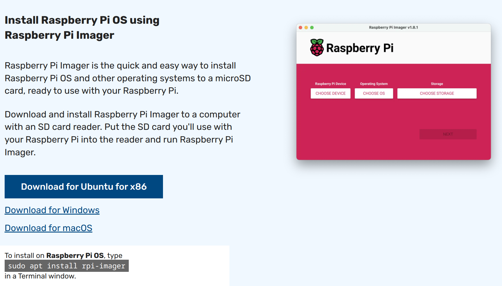
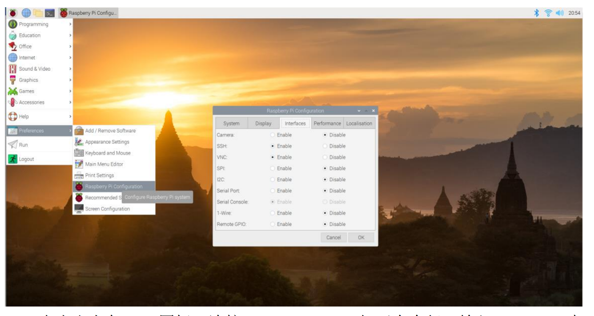

### Lab1实验报告：Raspberry Pi开发环境搭建

#### 一、实验介绍
本次实验将配置后续实验用到的软硬件环境，包括操作系统、网络、远程连接等。

#### 二、实验目标
1. 熟悉Raspberry Pi硬件组成及其引脚布局。
2. 完成Raspberry Pi OS镜像的下载与烧录。
3. 配置Wi-Fi，确保能够访问互联网。

#### 三、实验步骤
##### （1）硬件准备与检查
1. **确认所需材料**：
   - Raspberry Pi 4 Model B
   - microSD卡
   - 电源适配器（最好使用官方提供的USB-C电源,否则可能出问题）
   - HDMI显示器及HDMI线缆
   - 键盘和鼠标

2. **检查硬件状态**：
   - 插入microSD卡到Raspberry Pi的卡槽中。
     - 如果是使用过的卡，先用[SDFormatter](https://www.sdcard.org/downloads/formatter/sd-memory-card-formatter-for-windows-download/)工具格式化。
  
   - 连接显示器、键盘和鼠标（如果打算使用GUI）。
   - 将电源线插入Raspberry Pi，并确保另一端连接到合适的电源插座上。

##### （2）操作系统安装
1. **下载Raspberry Pi Imager工具**：
   - 访问[Raspberry Pi官方网站](https://www.raspberrypi.com/software/)下载Imager工具。

   
2. **选择并写入OS镜像**：
   - 打开Raspberry Pi Imager，点击“CHOOSE OS”按钮，选择推荐的Raspberry Pi OS (32-bit)版本。
   - 点击“CHOOSE STORAGE”，挑选之前准备好的microSD卡作为存储介质。
   - 确认无误后，点击“WRITE”开始烧录过程。请耐心等待，直到提示写入完成。
3. **配置屏幕参数**：
   - 在microSD卡的根目录下，找到`config.txt`文件，编辑并添加以下内容：
     ```bash
      max_usb_current=1 
      hdmi_force_hotplug=1 
      config_hdmi_boost=7 
      hdmi_group=2 
      hdmi_mode=1 
      hdmi_mode=87 
      hdmi_drive=1 
      display_rotate=0 
      hdmi_cvt 1024 600 60 6 0 0 0
     ```
     >在 `hdmi_cvt 1024 600 60 6 0 0 0 0` 这里填入实际显示屏的分辨率，不同
     显示器分辨率不同。

   - 保存文件后，将microSD卡插回Raspberry Pi中。

4. **初次启动与初始化设置**：
   - 将烧录好OS镜像的microSD卡重新插回Raspberry Pi后，给它通电。
   - 第一次启动时，根据屏幕上的指示进行语言、地区、时区等基本信息的配置。

##### （3）网络配置
1. **连接Wi-Fi**：
   - 在命令行中输入`sudo raspi-config`打开配置菜单。
   - 选择“Network Options”，然后按照提示输入您的Wi-Fi SSID和密码。
   
2. **验证网络连接**：
   - 使用`ping www.bing.com`测试是否能成功访问外部网站。

##### （4）配置开发环境
1. **更新软件包列表**：
   - 执行`sudo apt-get update`刷新本地数据库以获取最新的软件包信息。

2. **升级已安装的软件包**：
   - 使用`sudo apt-get upgrade`命令来更新所有现有的软件包至最新版本。

3. **安装额外的开发工具**：
   - 安装Git用于版本控制：
     ```bash
     sudo apt-get install git
     ```
   - 安装Vim编辑器：
     ```bash
     sudo apt-get install vim
      ```
4. **安装远程连接工具**：
   - 启动SSH服务：
     ```bash
     sudo systemctl start ssh
     ```
   - 验证SSH服务是否正常运行：
     ```bash
     sudo systemctl status ssh
     ```
   - 设置SSH服务开机自启动：
     ```bash
      sudo systemctl enable ssh
      ```
5. **在本地通过vscode连接远程Raspberry Pi**：
   - 安装[Remote - SSH](https://marketplace.visualstudio.com/items?itemName=ms-vscode-remote.remote-ssh)插件。
   - 在树莓派终端运行`ifconfig`命令查看IP地址。
   - 使用`Ctrl+Shift+P`打开命令面板，输入`Remote-SSH: Connect to Host`，然后输入Raspberry Pi的IP地址和用户名。
   - 输入密码后，即可通过VSCode连接到远程的Raspberry Pi。
   - 把`ssh-rsa`公钥添加到`~/.ssh/authorized_keys`文件中，实现无密码登录。
6. **远程可视化开发**:
   - 在本地安装[VNC Viewer](https://www.realvnc.com/en/connect/download/viewer/)。
   - 在树莓派上启用VNC Server：
  
   - 确保电脑和 Raspberry 在同一局域网。打开软件，在框内输入获取到的
Raspberry Pi ip 地址，回车。
   - 输入用户名和密码，即可远程连接到 Raspberry Pi 的桌面环境。

   
#### 四、总结
本实验完成了Raspberry Pi的初步设置，包括操作系统的安装、网络的配置以及开发环境的搭建。