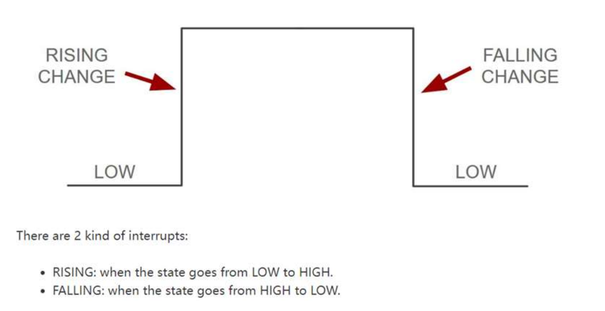
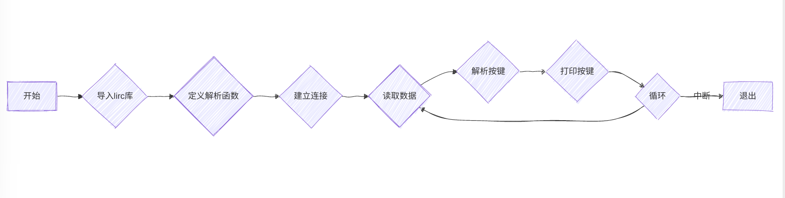

### Lab10实验报告：中断实验

#### 一、实验介绍
在计算机系统中，外部中断是指在程序执行过程中，由外部输入触发的一
种机制，用于暂停当前程序的执行，转而执行其他指定任务。外部中断的存在
主要是为了处理紧急事件，例如硬件设备的输入、定时器的到期等。树莓派也
可实现类似的功能。本次实验任务为通过中断机制在树莓派上实现对不同外接
设备的及时响应。任务一为通过中断实现对按键的响应，改变LED灯的状态；任二为通过中断实现按键每按下一次，超声波传感器测距一次。**最终的效果为：按下按键，LED灯亮，超声波传感器测距一次;松开按键，LED灯灭，超声波传感器不再测距**。

#### 二、实验原理
1. **树莓派中断函数**：
   - 使用`GPIO.add_event_detect()`方法来监控指定GPIO引脚的状态改变。此方法接受四个参数：
     - `channel`：需要监测的GPIO引脚编号。
     - `edge`：指定要监测的边沿类型，可以是上升沿（`GPIO.RISING`）、下降沿（`GPIO.FALLING`）或者两者皆可（`GPIO.BOTH`）。
     - `callback`：当检测到状态变化时调用的回调函数（可选）。
     - `bouncetime`：用于消除机械按键抖动的时间间隔（ms），即两次有效状态变化之间所需的最小时间差（可选）。
  
      !!! note "回调函数"
          回调函数：在编程中，回调函数是指在某个事件发生时由系统调用的函数。在这里，回调函数用于处理按键按下时的逻辑，例如切换LED的状态。

2. **`GPIO.wait_for_edge(channel, GPIO.RISING)`**：
   - 另一种方式是使用`GPIO.wait_for_edge()`函数，在检测到指定边沿之前阻止程序继续执行。这种方法占用较少CPU资源。

3. **按键去抖动**：
   - 由于物理按键按下时可能会产生短暂的电压波动（即“抖动”），因此在实际应用中通常会加入软件延时或者硬件滤波来确保每个按键动作只被记录一次,在[lab3](lab3.md)中已经有所涉及,当时是通过手动设置延时来实现的消抖。

#### 三、实验步骤
1. **建立电路**：
   - 连接Raspberry Pi、T型转接板和轻触按键模块之间的SIG(S)、VCC和GND引脚。
   - 将轻触按键模块的SIG(S)引脚连接到Raspberry Pi的GPIO23（BCM编号），VCC引脚接5V电源，GND引脚接地。
   - 把LED灯和超声波传感器的电路连接到树莓派上，具体连接方式见[lab6](lab6.md)。
  
2. **编写Python程序**:
   - 导入`RPi.GPIO`库，设置轻触按键的GPIO引脚编号。
   - 编写函数`button_callback()`，该函数用于处理轻触按键按下时的逻辑，例如切换LED灯的状态。
   - 使用`GPIO.add_event_detect()`方法监控轻触按键的状态变化，当检测到按键按下时调用`button_callback()`函数。
   - 编写函数`ultrasonic_callback()`，该函数用于处理超声波传感器测距的逻辑，每次按键按下时调用一次。
   - 使用`GPIO.wait_for_edge()`方法等待轻触按键按下，然后调用`ultrasonic_callback()`函数。

程序框图：

Python代码：

```python
import RPi.GPIO as GPIO
import time

BUTTON_PIN = 23
LED_PIN = 18
TRIG = 17
ECHO = 27  # 确保 ECHO 引脚正确

# 设置 GPIO 模式
GPIO.setmode(GPIO.BCM)
GPIO.setup(BUTTON_PIN, GPIO.IN, pull_up_down=GPIO.PUD_UP)
GPIO.setup(LED_PIN, GPIO.OUT)
GPIO.setup(TRIG, GPIO.OUT)
GPIO.setup(ECHO, GPIO.IN)

# 全局变量，用于控制超声波测量
measuring = False
pulse_start = 0
pulse_end = 0


def button_pressed_callback(channel):
    """按键按下回调函数：点亮 LED 并启动测距"""
    global measuring
    GPIO.output(LED_PIN, GPIO.HIGH)
    measuring = True  # 设置为 True 以允许测距
    GPIO.output(TRIG, False)  # 先拉低，再拉高，使得输出一个干净的脉冲
    time.sleep(0.01)

    GPIO.output(TRIG, True)
    time.sleep(0.00001)  # 10us 脉冲
    GPIO.output(TRIG, False)


def button_released_callback(channel):
    """按键松开回调函数：熄灭 LED"""
    global measuring
    GPIO.output(LED_PIN, GPIO.LOW)
    measuring = False  # 设置为 False 以停止测距


def echo_callback(channel):
    """ECHO 引脚状态变化回调函数：计算距离"""
    global measuring, pulse_start, pulse_end
    if measuring:  # 只有在测量状态下才进行计算
        if GPIO.input(ECHO) == GPIO.HIGH:
            pulse_start = time.time()
        elif GPIO.input(ECHO) == GPIO.LOW:
            pulse_end = time.time()
            pulse_duration = pulse_end - pulse_start
            distance = pulse_duration * 34300 / 2
            print(f"Distance: {distance:.2f} cm")


# 添加按键按下和松开事件检测
GPIO.add_event_detect(
    BUTTON_PIN, GPIO.FALLING, callback=button_pressed_callback, bouncetime=200
)  # 按下
GPIO.add_event_detect(
    BUTTON_PIN, GPIO.RISING, callback=button_released_callback, bouncetime=200
)  # 松开

# 添加 ECHO 引脚状态变化检测
GPIO.add_event_detect(ECHO, GPIO.BOTH, callback=echo_callback)

try:
    print("Press the button...")
    while True:
        time.sleep(0.1)

except KeyboardInterrupt:
    print("\nCleaning up...")
    GPIO.cleanup()
```


