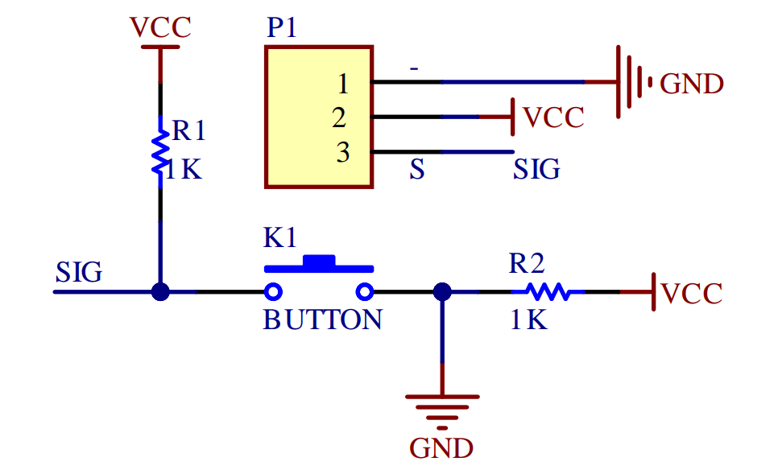
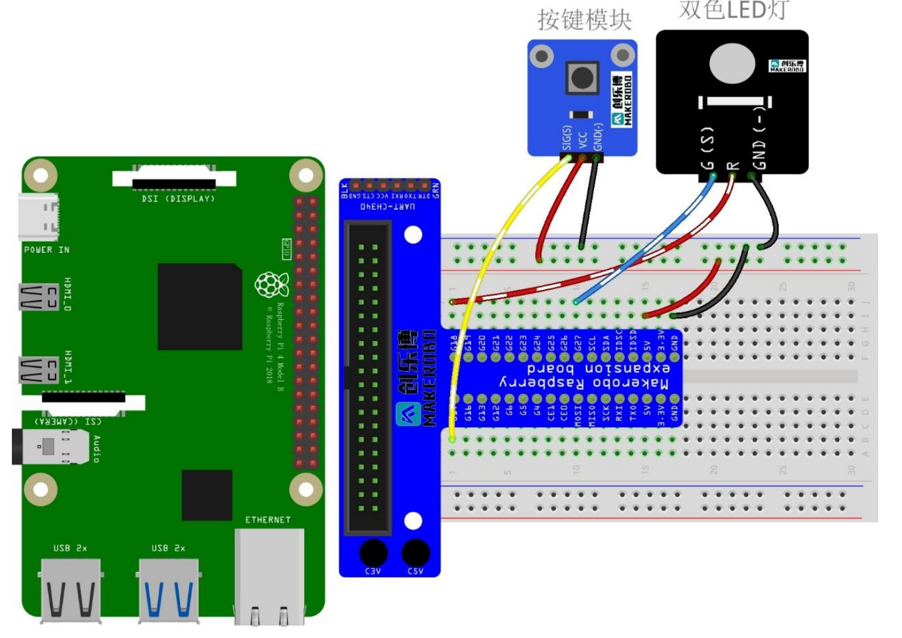
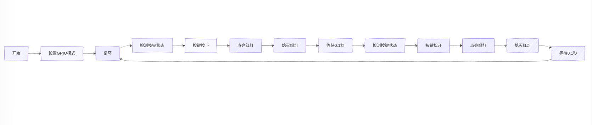
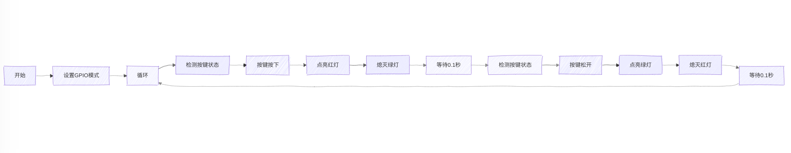

### Lab3实验报告：轻触开关实验

#### 一、实验介绍
轻触开关模块是最常见的开关模块，内部有一个轻触开关（按键开关）。-引
脚接地，中间引脚接 VCC。按下按键时，S 脚输出为低电平；松开按键时，S 脚
输出为高电平。
该模块的原理图为：



#### 二、实验原理
在本实验中，使用轻触开关作为树莓派的输入设备。将树莓派某 GPIO 口设
置为输入模式，通过此 GPIO 口检测轻触开关的 S 引脚。当检测到 S 引脚为低电
平时，表示按键被按下，检测到 S 引脚为高电平时，表示按键松开。
通过两种不同颜色的 LED 指示按键的状态。即当按键按下时，一种颜色 LED
亮；按键松开时，另一种 LED 亮。
!!! warning
    在编写代码时，需要注意消除好按键抖动。
   
!!! tip
      在Python中，`time.sleep()`函数可以让程序暂停执行一段时间（秒），通过延时函数能有效地减少按键抖动带来的误触发问题。


#### 三、实验步骤
1. **硬件连接**：
   连接示意图如下：
   

2. **编写代码**：
   使用Mu编辑器或VSCode等工具，编写Python代码来控制双色LED和轻触开关。
   代码逻辑如下：
   - 设置GPIO引脚的模式（输入/输出）。
   - 不断检测轻触开关的状态，根据按键的状态控制LED的亮灭。
   - 为了防止按键抖动，可以在检测到按键状态变化后加入一个小的延时。

程序框图：



```python
import RPi.GPIO as GPIO
import time

RED_PIN = 19  
GREEN_PIN = 20  
SWITCH_PIN = 21  # 开关引脚

GPIO.setmode(GPIO.BCM)
GPIO.setup(RED_PIN, GPIO.OUT)
GPIO.setup(GREEN_PIN, GPIO.OUT)
GPIO.setup(SWITCH_PIN, GPIO.IN, pull_up_down=GPIO.PUD_UP)

def switch_with_delay(pin, delay=0.1):
   """检测开关状态"""
    state = GPIO.input(pin)
    time.sleep(delay)
    return state == GPIO.input(pin)

try:
   while True:
      if switch_with_delay(SWITCH_PIN):
            GPIO.output(RED_PIN, GPIO.HIGH)
            GPIO.output(GREEN_PIN, GPIO.LOW)
      else:
            GPIO.output(RED_PIN, GPIO.LOW)
            GPIO.output(GREEN_PIN, GPIO.HIGH)
   
   except KeyboardInterrupt:
      print("Exiting...")
   finally:
      GPIO.cleanup()
```

3. **实验拓展**
   
   通过开关和 LED 及相应的编程，实现以下功能：
   1. 按一下按键，LED 红灯亮起；
   2. 再次按一下按键，LED 红灯闪烁；
   3. 再次按一下按键，LED 绿灯亮；
   4. 再次按一下按键，LED 绿灯闪烁；
再次按下按键红灯亮起……如此循环。

程序框图：



Python代码：
```python
import RPi.GPIO as GPIO
import time

RED_PIN = 19  
GREEN_PIN = 20  
SWITCH_PIN = 21  # 开关引脚

GPIO.setmode(GPIO.BCM)
GPIO.setup(RED_PIN, GPIO.OUT)
GPIO.setup(GREEN_PIN, GPIO.OUT)
GPIO.setup(SWITCH_PIN, GPIO.IN, pull_up_down=GPIO.PUD_UP)

def switch_with_delay(pin, delay=0.1):
   """检测开关状态"""
    state = GPIO.input(pin)
    time.sleep(delay)
    return state == GPIO.input(pin)

def toggle_led(pin):
   """切换LED状态"""
    GPIO.output(pin, not GPIO.input(pin))

try:
   while True:
      if switch_with_delay(SWITCH_PIN):
            toggle_led(RED_PIN)
            time.sleep(0.5)
            toggle_led(RED_PIN)
      else:
            toggle_led(GREEN_PIN)
            time.sleep(0.5)
            toggle_led(GREEN_PIN)
   
   except KeyboardInterrupt:
      print("Exiting...")
   finally:
      GPIO.cleanup()
```

