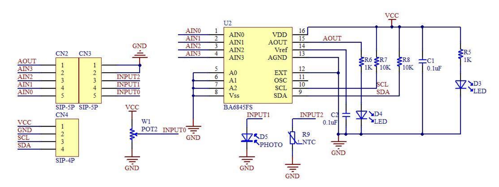
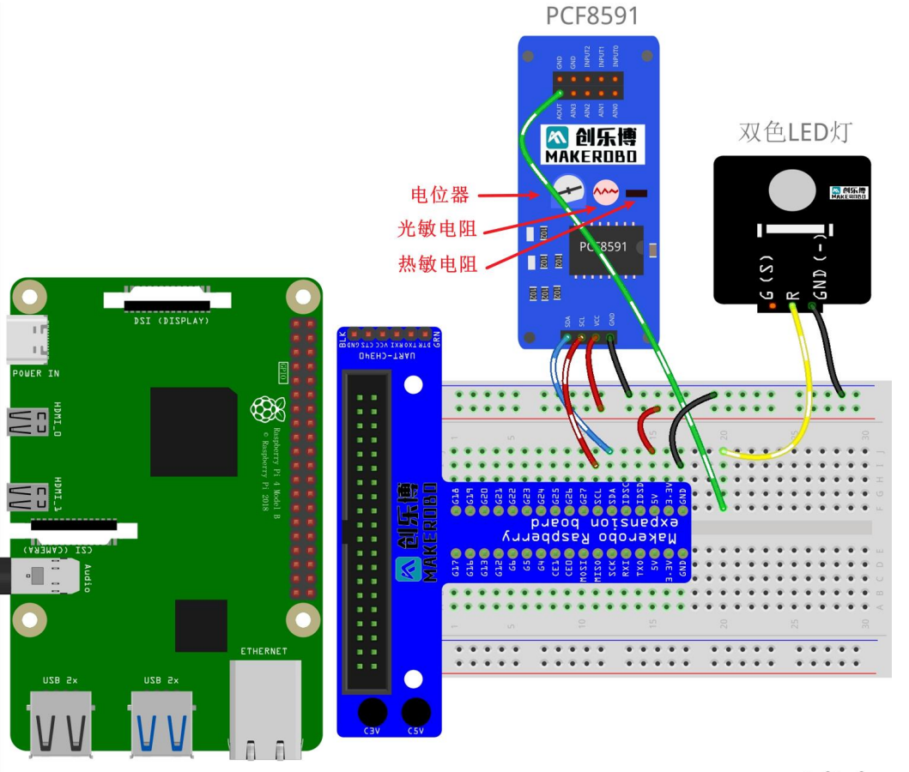
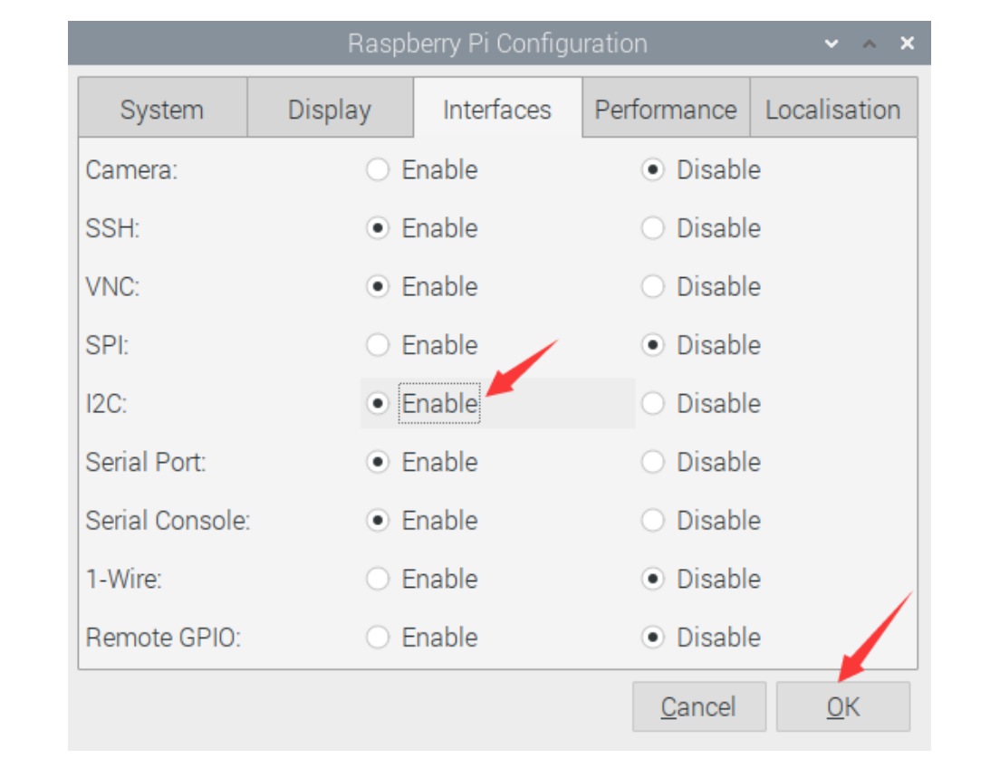
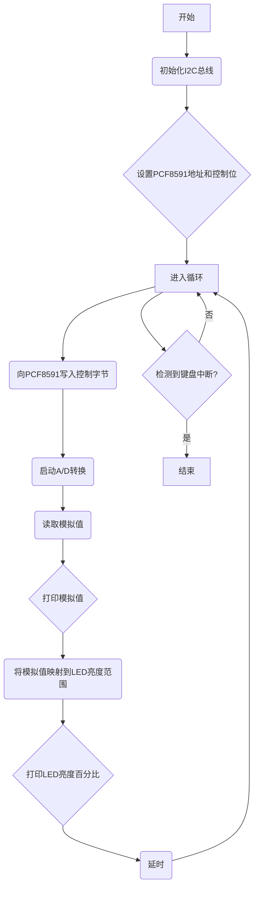

### Lab4实验报告：PCF8591模数转换器实验

#### 一、实验介绍
PCF8591 是一款单芯片，单电源，低功耗 8 位 CMOS 数据采集设备，具有
四个模拟输入，一个模拟输出和一个串行 $I^2C$ 总线接口。三个地址引脚 $A_0，A_1
和 A_2$ 用于对硬件地址进行编程，从而允许使用多达 8 个连接到 $I^2C$ 总线的设备，
而无需额外的硬件。通过两行双向 $I^2C$ 总线串行传输与设备之间的地址，控制和
数据。
该设备的功能包括模拟输入多路复用，片上跟踪和保持功能，8 位模数转换
和 8 位数模转换。最大转换率由 $I^2C$ 总线的最大速度决定。
本次实验目标为：通过控制 PCF8591，将 LED 灯点亮。


#### 二、实验原理
1. **PCF8591特性**：
   - PCF8591是一款单芯片、低功耗的CMOS数据采集设备，它包含模拟输入多路复用、片上跟踪保持功能、8位A/D转换和8位D/A转换。
   - 设备通过I2C总线接口与主控制器通信，默认地址为0x48，但可以通过设置地址引脚A0, A1, 和A2改变其硬件地址，最多允许连接8个相同类型的从设备到同一$I^2C$总线上。
   - 发送到 PCF8591 器件的第二个字节将被存储在其控制寄存器中，并且需要
   控制器件功能。控制寄存器的高半字节用于使能模拟输出，并将模拟输入编程为
   单端或差分输入。下半字节选择由上半字节定义的一个模拟输入通道。如果设置
   了自动增加标志，则在每次 A/D 转换后，通道编号会自动递增。
   - 在本实验中，AINO(模拟输入 0)端口用于接收来自电位计模块的模拟信号，
   AOUT(模拟输出)用于将模拟信号输出到双色 LED 模块，以便改变 LED 的亮度。
   该模块的原理图如下所示：
      
   需要注意的是，除了电位器，PCF8591 模块还带有光电二极管和负温度系数（NTC）
   热敏电阻，原理图如下所示。当外部光强或温度变化时，光敏或热敏电阻的阻值
   也会发生变化，通过采集 INPUT1 和 INPUT2 的电压值，可以实现光强和温度感
   知。


2. **I2C总线通信**：
   - $I^2C$是一种简单的两线式串行通信标准，由SDA（数据线）和SCL（时钟线）组成。在本实验中，Raspberry Pi作为主设备，负责发送命令给PCF8591并接收来自它的响应。

3. **模拟信号采集与处理**：
   - 在这个实验里，AIN0端口被用来接收来自电位计模块的模拟信号，而AOUT端口则输出模拟电压以驱动双色LED模块，从而改变LED的亮度。
   - 当外部条件发生变化时（例如光照强度或温度变化），相应的传感器（如光电二极管或NTC热敏电阻）的阻值也会随之变化，通过测量这些元件两端的电压，我们可以得知环境的变化情况。

#### 三、实验步骤
1. **硬件连接**：
   - 连接Raspberry Pi、T型转接板和PCF8591模块之间的SDA、SCL、VCC和GND引脚。
   - 将双色LED的中间引脚（红色）连接到PCF8591的AOUT引脚，GND引脚接地。
   

2. **配置I2C总线**：
   - 点击Raspberry Pi桌面环境中的开始菜单，选择Preferences -> Raspberry Pi Configuration。
   - 进入Interfaces标签页，开启I2C选项，点击OK保存更改并重启系统。
     
  
3. **查看设备地址**：
   - 在终端中输入`sudo i2cdetect -y 0`命令，查看I2C总线上所有设备的地址。
   - 如果一切正常，应该能看到PCF8591的地址（默认为0x48）显示在对应的位置上。 

4. **编写代码**：
   - 使用Python语言编写程序，首先需要安装`smbus`库，它可以方便地操作I2C设备。
   - 导入必要的库后，创建一个SMBus实例并与PCF8591建立连接，读取AIN0上的模拟值并根据该值调整AOUT输出，进而控制LED亮度。

程序框图：

Python代码
```python
import smbus
import time

address = 0x48  # 地址
control_bit = 0x40  # 控制字

bus = smbus.SMBus(1)

try:
    while True:
        # 向PCF8591写入控制字节
        bus.write_byte(address, control_bit)
        
        analog_value = bus.read_byte(address)
        
        print("Analog Value:", analog_value)
        
        # 把模拟值映射到LED亮度范围
        led_brightness = int((analog_value / 255.0) * 100)
        
        print("LED Brightness (%):", led_brightness)
        
        time.sleep(0.1)

except KeyboardInterrupt:
   print("Exiting...")
```