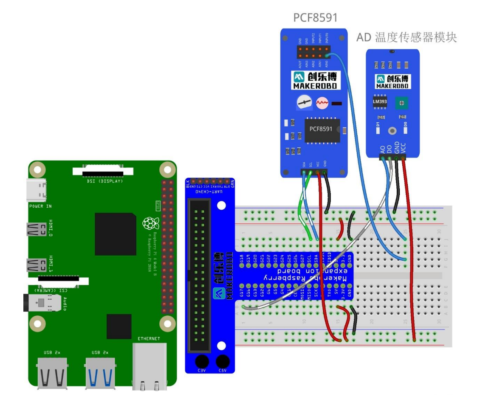
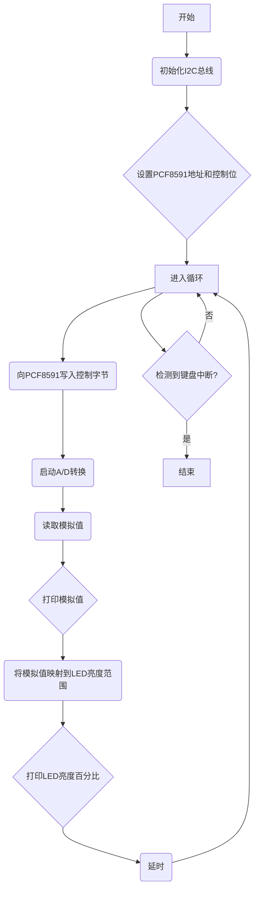

### Lab5实验报告：模拟温度传感器实验

#### 一、实验介绍
温度感测模块提供易于使用的传感器，它带有模拟和数字输出。该温度模块
使用 NTC（负温度系数）热敏电阻来检测温度变化，其对温度感应非常灵敏。
NTC 热敏电阻电路相对简单，价格低廉，组件精确，可以轻松获取项目的温度数
据，因此广泛应用于各种温度的感测与补偿中。 简而言之，**NTC 热敏电阻将随
温度变化传递为电阻变化**，利用这种特性，我们可以通过测量电阻网络(例如分
压器)的电压来检测室内/环境温度。
本次实验的任务为：获取当前环境的温度值。


#### 二、实验原理
1. **NTC热敏电阻特性**：
   - 在本实验中，我们将使用Steinhart-Hart方程来计算热敏电阻的精确温度，这是一个用于描述热敏电阻电阻-温度特性的经验公式，即Steinhart-Hart方程。
  -  Steinhart-Hart方程表达式为 $\frac{1}{T} = A + B\ln(R) + C(\ln(R))^3$，其中$T$是以开尔文为单位的绝对温度，$R$是热敏电阻在给定温度下的电阻值，而$A$, $B$, $C$ 则是取决于具体型号的常数参数。对于本次实验，假设$R_0$为10kΩ，$B$值为3950K。

2. **电路**：
   - 温度传感器模块由一个NTC热敏电阻和一个固定电阻组成分压电路。当环境温度发生变化时，热敏电阻的阻值也会随之改变，从而影响分压点处的电压输出。
    
   - 通过连接到PCF8591的模拟输入端口AIN0，我们可以采集这个电压信号，并将其转换为数字形式以便后续分析。

3. **数据处理**：
   - 首先从PCF8591读取经过A/D转换后的数值，然后根据已知条件（如供电电压5V，ADC分辨率为8位即0~255对应0~5V）计算出对应的模拟电压。
   - 接着利用分压比公式计算得到热敏电阻的实际阻值，再代入Steinhart-Hart方程求解温度T。

#### 三、实验步骤
1. **硬件连接**：
   - 连接Raspberry Pi、T型转接板和PCF8591模块之间的SDA、SCL、VCC和GND引脚。
   - 将模拟温度传感器的AO引脚连接到PCF8591模块的AIN0，DO引脚可以留空或接地，VCC引脚接5V电源，GND引脚接地。

2. **配置I2C总线**：
  见[Lab4实验报告](lab4.md)中的第2步。

3. **编写代码**
   - 导入必要的库。
   - 创建一个SMBus实例并与PCF8591建立连接，读取AIN0上的模拟值并根据该值计算温度。

程序框图：

Python代码：

```python
import smbus
import math
import time

# Define the I2C address of the PCF8591 and control bits
address = 0x48  # Default address for PCF8591
control_bit = 0x40  # Command to start conversion on channel 0 (AIN0)

# Constants for the thermistor calculation
R0 = 10000  # Resistance at 25°C in ohms
B = 3950  # Thermistor constant in Kelvin
T0 = 298.15  # Standard temperature in Kelvin (25°C)
Vcc = 5.0  # Supply voltage in volts

# Initialize the SMBus library
bus = smbus.SMBus(1)  # Use I2C bus 1

def read_temperature():
    try:
        # Write the control byte to initiate an A/D conversion on channel 0
        bus.write_byte(address, control_bit)
        
        analog_value = bus.read_byte(address)
        
        Vr = (analog_value / 255.0) * Vcc
        
        # Calculate the resistance of the thermistor
        Rt = R0 * Vr / (Vcc - Vr)
        
        # Apply the Steinhart-Hart equation to calculate temperature
        temp_kelvin = 1 / (math.log(Rt / R0) / B + 1 / T0)
        temp_celsius = temp_kelvin - 273.15
        
        return round(temp_celsius, 2)
    
    except Exception as e:
        print("Error reading temperature:", str(e))
        return None

try:
    while True:
        temperature = read_temperature()
        if temperature is not None:
            print(f"Temperature: {temperature}°C")
        else:
            print("Failed to read temperature.")
        
        time.sleep(1)  # Small delay between readings

except KeyboardInterrupt:
   print("\nExiting program.")
```