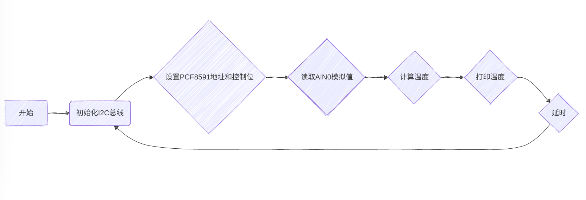

# Lab6实验报告：超声波传感器测距实验

#### 一、实验介绍
超声波测距模块主要是由两个通用的压电陶瓷超声传感器，并加外围信号处
理电路构成的。超声传感器中的一个用作发射器，将电信号转换为 40KHz 超声
波脉冲信号；另一个一个用作接收器，监听发射的脉冲。
超声波距离传感器体积小，易于在项目中使用，可以提供 2cm 至 400cm 左
右的非接触距离检测，精度为 3mm。由于它的工作电压为 5 伏，因此可以直接
连接到 Raspberry 或任何其他 5V 逻辑微控制器。
该传感器有 4 个引脚：
- **VCC**：5V电源供电；
- **Trig**：触发引脚，用于启动超声波发射；
- **Echo**：回波引脚，表示是否检测到返回的超声波；
- **GND**：接地。

该模块的原理图如下：


#### 二、实验原理
1. **超声波传感器工作流程**：
   - 超声波传感器包括一个发射器和一个接收器。当触发引脚（Trig）接收到至少10微秒的高电平脉冲时，它会发送8个周期的40kHz超声波脉冲。
   - 接收器监听反射回来的超声波，并将Echo引脚置为高电平直到接收到回波为止。此时，Echo引脚保持高电平的时间长度与超声波往返一次所需的时间成正比。
   - 由于声音传播速度约为343米/秒（在20摄氏度空气中），因此可以通过测量Echo引脚高电平持续的时间来确定目标距离。
   - 测试距离（单位：厘米）= Echo引脚高电平持续时间（秒）* 34300 / 2

2. **注意事项**：
   - 注：Echo 引脚变为高电平时为 5V，树莓派 GPIO 输入一般不能超过 3.3V，
   故应使用分压器测量。但由于本次实验 Echo 引脚高电平时间非常短，故可不使
   用分压。

#### 三、实验步骤
1. **硬件连接**：
   - 连接Raspberry Pi、T型转接板和超声波传感器之间的VCC、Trig、Echo和GND引脚。
   - 将超声波传感器的Trig引脚连接到Raspberry Pi的GPIO17（BCM编号），Echo引脚连接到GPIO18（BCM编号），同时确保VCC接到5V电源，GND接地。

2. **编写代码**：
   - 导入`RPi.GPIO`库，设置Trig和Echo引脚的BCM编号。
   - 编写函数`get_distance()`，该函数负责设置Trig引脚输出10微秒的高电平脉冲，然后等待Echo引脚变为高电平，记录开始时间；接着再次等待Echo引脚变为低电平，记录结束时间。最后利用这两个时间点计算出超声波往返一次所花费的时间，并据此换算成实际距离。

程序框图：


```python
import RPi.GPIO as GPIO
import time

TRIG = 17 # 传感器的Trig引脚
ECHO = 18 # Echo引脚 

GPIO.setmode(GPIO.BCM)
GPIO.setup(TRIG, GPIO.OUT)
GPIO.setup(ECHO, GPIO.IN)

def get_distance():
    # 确保Trig引脚为低电平
    GPIO.output(TRIG, False)
    time.sleep(0.2)
    GPIO.output(TRIG, True)
    time.sleep(0.00001)
    GPIO.output(TRIG, False)

    # 记录开始时间
    while GPIO.input(ECHO) == 0:
        pulse_start = time.time()

    # 记录结束时间
    while GPIO.input(ECHO) == 1:
        pulse_end = time.time()

    pulse_duration = pulse_end - pulse_start

    distance = pulse_duration * 17150 
    distance = round(distance, 2)

    return distance

try:
    print("Measuring distance...")
    while True:
        dist = get_distance()
        print(f"Distance: {dist} cm")
        time.sleep(1)

except KeyboardInterrupt:
    print("Measurement stopped by user")

finally:
    GPIO.cleanup()
```