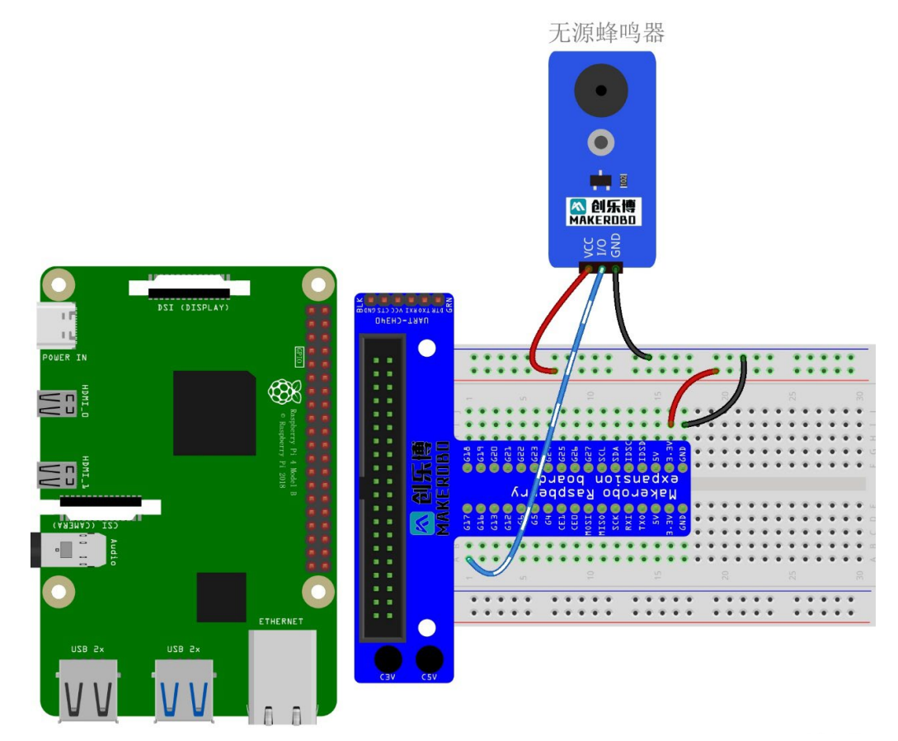

### Lab7实验报告：蜂鸣器实验

#### 一、实验介绍
蜂鸣器属于声音模块，一般可以分为有源蜂鸣器和无源蜂鸣器。有源和无源
是指内部是否有震荡源。有源蜂鸣器内置振荡器，没有频率变化，直接接上合适
的直流电源即可发声，常用于发出单一的提示性报警声音；无源蜂鸣器由于内部
没有震荡源，所以其驱动方式为脉冲频率调制（Pulse-Frequency Modulation，PFM），
可以通过调控脉冲频率发出不同频率的声音信号。本次实验任务为利用蜂鸣器播
放一段音乐（音乐自选），并通过编程控制蜂鸣器发出相应的音符。

#### 二、实验原理
1. **有源蜂鸣器**：
   - 内部含有振荡电路，可以将恒定的直流电转化为一定频率的脉冲信号，因此只需给它施加合适的直流电压即可让它发出声音。
   - 在本实验中使用的有源蜂鸣器为低电平触发，即当GPIO引脚设置为低电平时，蜂鸣器会响起；反之则停止发声。

2. **无源蜂鸣器**：
   - 没有内置驱动电路，必须由外部提供特定频率的方波信号才能工作。由于声音频率可控，可以发出“do re mi fa so la xi”的声效。在一些特例中，可以和 LED 复用一个控制口。
   - PFM（Pulse-Frequency Modulation）是一种仅使用两个电平（高/低）表示模拟信号的调制方式，在这里用来生成可变频率的脉冲序列以驱动无源蜂鸣器。
   - PWM（Pulse-Width Modulation）虽然不是本次实验的重点，但作为一种常见的调制技术，它同样适用于控制蜂鸣器或其他设备的输出特性。

3. **编程思路**：
   - 对于有源蜂鸣器，只需要简单地配置对应的GPIO引脚状态为高或低就可以控制其开关。
   - 对于无源蜂鸣器，则需要创建一个包含多个音符频率值的列表，并依次遍历这个列表，每次根据当前音符设定适当的PWM频率，使蜂鸣器按照指定旋律发声。

#### 三、实验步骤
#### （1）有源蜂鸣器实验
1. **硬件连接**：
   - 连接Raspberry Pi、T型转接板和有源蜂鸣器模块之间的I/O、VCC**3.3V**和GND引脚。
   - 通电后，蜂鸣器会发出持续的“滴滴”声音。

#### （2）无源蜂鸣器实验
1. **硬件连接**：
   - 连接Raspberry Pi、T型转接板和无源蜂鸣器模块之间的I/O、VCC和GND引脚。
   - 确保选择支持PWM输出的GPIO引脚（本次使用GPIO11，BCM编号）。

2. **编写代码**：
   - 导入`RPi.GPIO`和`pigpio`库，设置蜂鸣器的GPIO引脚和频率参数。
   - 编写函数`play_music()`，该函数定义了一系列音符及其对应的频率，并通过循环调用这些频率来驱动蜂鸣器发出音乐。

程序框图：


```python
import RPi.GPIO as GPIO
import pigpio
import time

BUZZER_PIN = 18

pi = pigpio.pi()

# 音符及其对应频率（Hz）
NOTES = {
    "C4": 262,
    "D4": 294,
    "E4": 330,
    "F4": 349,
    "G4": 392,
    "A4": 440,
    "B4": 494,
    "C5": 523,
    "D5": 587,
    "E5": 659,
    "F5": 698,
    "G5": 784,
    "A5": 880,
    "B5": 988,
}

MELODY = [
    "C4",
    "D4",
    "E4",
    "C4",
    "E4",
    "D4",
    "C4",
    "C4",
    "D4",
    "D4",
    "E4",
    "E4",
    "C4",
    "D4",
    "E4",
]


def set_frequency(freq):
    """通过PWM设置蜂鸣器的频率"""
    pi.hardware_PWM(BUZZER_PIN, freq, 500000)


def play_music(melody):
    try:
        for note in melody:
            if note in NOTES:
                set_frequency(NOTES[note])
                time.sleep(0.5)  # 每个音符持续0.5秒
                set_frequency(0)  # 停止发声
                time.sleep(0.1)  # 间隔0.1秒

    except KeyboardInterrupt:
        print("Music stopped by user")

    finally:
        pi.stop()
        GPIO.cleanup()


if __name__ == "__main__":
    print("Playing music...")
    play_music(MELODY)
```