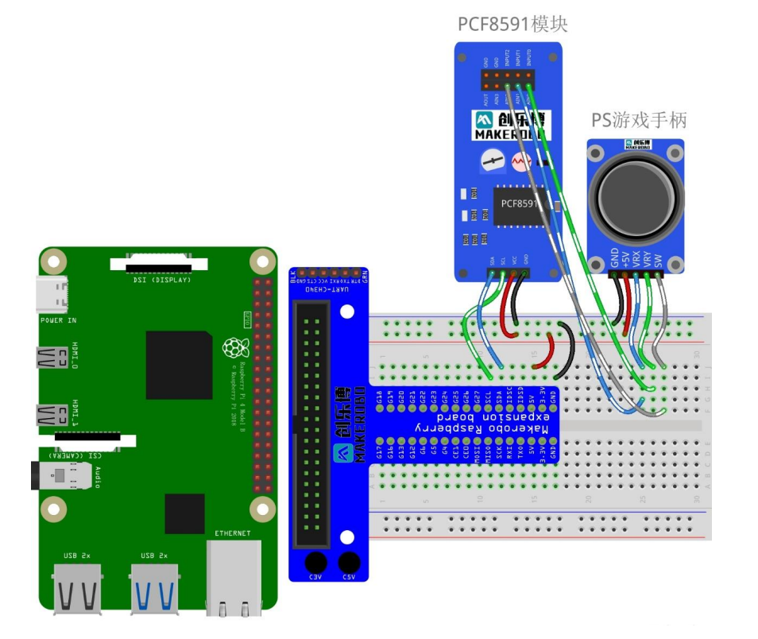
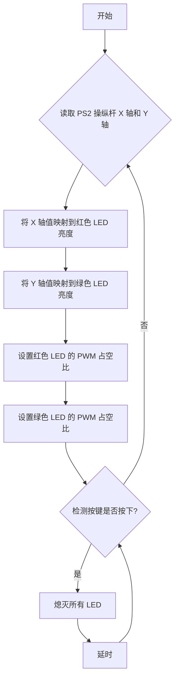

### Lab8实验报告：PS2操纵杆实验

#### 一、实验介绍
PS2 操纵杆模块类似于手柄中的模拟游戏杆，是一种输入设备，其在许多项
目中得到应用。它是通过以 90 度角安装两个电位计来制成的。电位计连接到以
弹簧为中心的短杆上。本次实验任务为用 PS2 操纵杆控制不同的 LED 以及其亮
度变化。一个轴控制红灯亮度，另一个轴控制绿灯亮度，按下按钮则熄灭两者。


#### 二、实验原理
1. **PS2操纵杆工作原理**：
   PS2 操纵杆有两个模拟输出(对应 X 和 Y 坐标)和一个数字输出，表示是否在
Z 轴上按下。处于静止位置时，其在 X 和 Y 方向产生约 2.5V 的输出，移动操纵
杆将导致输出在 0v 到 5V 之间变化，具体取决于其方向。按下按钮时，其 SW 引
脚输出为低电平。
其内部结构实际上就是两个 X, Y 方向上的滑动变阻器。当 VCC 连接 5V 电
压时，X，Y 方向电压常态时为 2.5V，最大值 5V，最小值 0V，用 PCF8591 模数
转换模块的两个通道分别检测电压值的变化就可以知道摇杆指向的位置了。


2. **电路连接**：
   - 在本实验中，我们将PS2操纵杆的X轴（VRX）和Y轴（VRY）连接到PCF8591的模拟输入端口AIN0和AIN1，而按钮（SW）则可以连接到另一个GPIO引脚或者留空。
   - PCF8591负责将来自操纵杆的模拟电压信号转换为数字值，这些数值可以在Raspberry Pi上进一步处理以确定操纵杆的具体位置。

3. **数据处理与控制逻辑**：
   - 通过读取PCF8591提供的数字化后的X轴和Y轴数据，我们可以得知当前操纵杆指向的位置。
   - 根据操纵杆的位置，我们可以改变连接到PCF8591模拟输出端口AOUT的LED亮度（0-255）。例如，当操纵杆位于中心位置时，LED保持一定亮度；随着操纵杆向任意方向偏移，相应地增加或减少LED的亮度。

#### 三、实验步骤
1. **硬件连接**：
   - 连接Raspberry Pi、T型转接板、PCF8591模块以及PS2操纵杆之间的SDA、SCL、VCC、GND、VRX、VRY和SW引脚。
   - 将PS2操纵杆的VRX引脚连接到PCF8591模块的AIN0，VRY引脚连接到AIN1，SW引脚可以根据需要选择性连接到额外的GPIO引脚，VCC引脚接5V电源，GND引脚接地。

2. **配置I2C总线**：
见[Lab4实验报告](lab4.md)中的第2步。

1. **编写代码**：
   - 导入必要的库。
   - 创建一个SMBus实例并与PCF8591建立连接，读取AIN0和AIN1上的模拟值，并根据这些值计算出对应的LED亮度。

程序框图：

Python代码
```python
import smbus
import RPi.GPIO as GPIO
import time

# I2C 地址
PCF8591_ADDRESS = 0x48

# GPIO 引脚
RED_LED_PIN = 27
GREEN_LED_PIN = 22
BUTTON_PIN = 17

# 初始化
bus = smbus.SMBus(1)  # 使用 I2C 总线 1
GPIO.setmode(GPIO.BCM)
GPIO.setup(RED_LED_PIN, GPIO.OUT)
GPIO.setup(GREEN_LED_PIN, GPIO.OUT)
GPIO.setup(BUTTON_PIN, GPIO.IN, pull_up_down=GPIO.PUD_UP)


def read_adc(channel):
    bus.write_byte(PCF8591_ADDRESS, 0x40 | channel)  # 选择通道
    bus.read_byte(PCF8591_ADDRESS)  # 丢弃第一次读取
    return bus.read_byte(PCF8591_ADDRESS)


try:
    while True:
        x_value = read_adc(0)  # 读取 X 轴
        y_value = read_adc(1)  # 读取 Y 轴

        # 将 ADC 值 (0-255) 映射到 PWM 值 (0-100)
        red_brightness = int(x_value / 255 * 100)
        green_brightness = int(y_value / 255 * 100)

        # 使用 PWM 控制 LED 亮度（你需要设置 GPIO 为 PWM 输出）
        red_pwm = GPIO.PWM(RED_LED_PIN, 100)  # 100Hz 频率
        green_pwm = GPIO.PWM(GREEN_LED_PIN, 100)
        red_pwm.start(red_brightness)
        green_pwm.start(green_brightness)

        if GPIO.input(BUTTON_PIN) == GPIO.LOW:  # 按键按下
            red_pwm.stop()
            green_pwm.stop()
            GPIO.output(RED_LED_PIN, GPIO.LOW)
            GPIO.output(GREEN_LED_PIN, GPIO.LOW)
            time.sleep(0.5)  # 延时防止抖动
        else:
            red_pwm.ChangeDutyCycle(red_brightness)
            green_pwm.ChangeDutyCycle(green_brightness)

except KeyboardInterrupt:
    red_pwm.stop()
    green_pwm.stop()
    GPIO.cleanup()

```