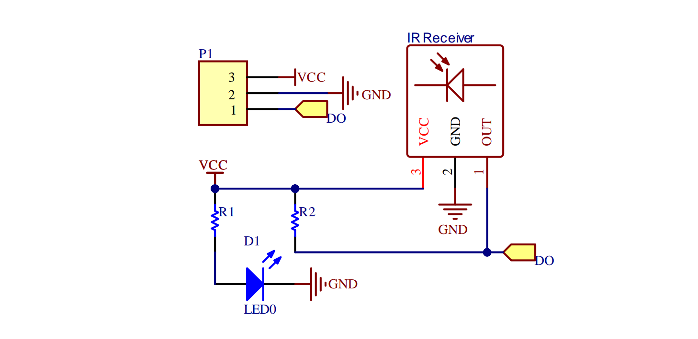
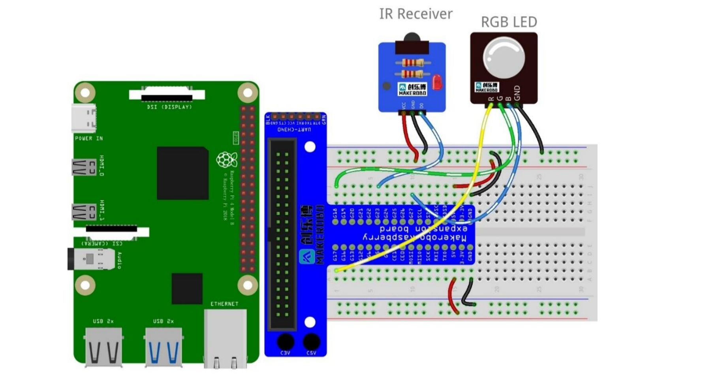
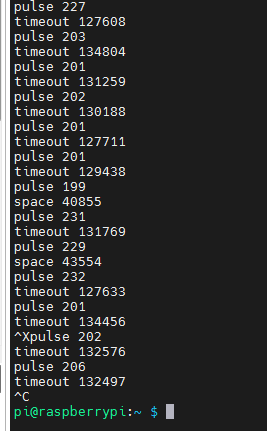
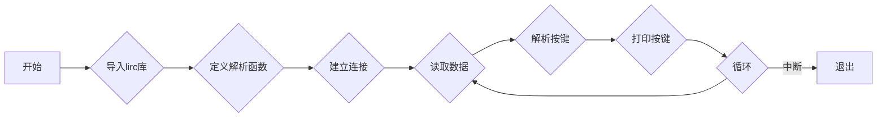

### Lab9实验报告：红外遥控实验

#### 一、实验介绍
遥控器接收头是用于接收遥控器所发射信号进而读取按键信息而执行操作
的一种光电信号转换器件。
遥控器接收头是利用最新的 IC 技术开发和设计出来的小型红外控系统接收
器。在支架上装着 PIN 二极管和前置放大器，环氧树脂包装成一个红外过滤器，
解调输出信号可以由微处理器解码，一般三条腿的红外线遥控接收头是接收、放
大、解调一体头，接收头输出的是解调后的数据信号，Raspberry pi 里面需要相
应的读取程序。
红外通信是利用红外技术实现两点间的近距离保密通信和信息转发。
它一般由红外发射和接收系统两部分组成。发射系统对一个红外辐射源进行
调制后发射红外信号，而接收系统用光学装置和红外探测器进行接收，就构成红
外通信系统。


#### 二、实验原理
在本实验中，我们使用 lirc 库读取遥控器按钮返回的红外信号，并将它们转
换为按钮值。
#### 三、实验步骤
1. **连接电路**
   连接遥控器接收头到 Raspberry Pi 的 GPIO 引脚上，如下图所示：
2. **安装LIRC及相关配置**：
   - 使用以下命令安装LIRC软件包及其依赖项：
     ```bash
     sudo apt-get update
     sudo apt-get install lirc
     ```
   - 修改`/boot/config.txt`文件中的红外模块部分，确保启用了红外接收功能，并指定了正确的GPIO引脚编号（例如接收引脚为22，发射引脚为23）。添加或修改如下行：
     ```text
     dtoverlay=gpio-ir,gpio_pin=22
     dtoverlay=gpio-ir-tx,gpio_pin=23
     ```

3. **调整驱动设置**：
   - 编辑位于`/etc/lirc/lirc_options.conf`的LIRC配置文件，更改默认驱动程序和设备路径：
     ```bash
     sudo nano /etc/lirc/lirc_options.conf
     ```
     将内容更改为：
     ```text
     driver = default
     device = /dev/lirc0
     ```

4. **重启系统**：
   - 执行完上述配置更改后，请重启Raspberry Pi以使新的设置生效：
     ```bash
     sudo reboot
     ```

5. **测试IR接收器**：
   - 重启完成后，可以使用`irw`命令查看当前接收到的红外信号。打开终端窗口并输入：
     ```bash
     irw
     ```
   - 此时按下遥控器上的任意按键，观察屏幕上的十六进制代码输出。
6. **记录红外代码**:
   在终端输入`irrecord -l`命令，按照提示操作，记录红外遥控器的按键代码。
   屏幕上输出的十六进制代码如下：
   ```text
   KEY_0
   KEY_102ND
   KEY_10CHANNELSDOWN
   KEY_10CHANNELSUP
   KEY_1
   KEY_2
   KEY_3
   KEY_3D_MODE
   KEY_4
   KEY_5
   KEY_6
   KEY_7
   KEY_8
   KEY_9
   KEY_A
   KEY_AB
   KEY_ADDRESSBOOK
   KEY_AGAIN
   KEY_ALTERASE
   KEY_ANGLE
   KEY_APOSTROPHE
   KEY_APPSELECT
   KEY_ARCHIVE
   KEY_ASPECT_RATIO
   KEY_ASSISTANT
   KEY_ATTENDANT_OFF
   ```

7. **开始录制**：
   在终端输入`irrecord -d /dev/lirc0 ~/lircd.conf`命令，按照提示操作，录制红外遥控器的按键代码。

8. **保存文件**:
   保存文件后，将其复制到`/etc/lirc/lircd.conf`目录下：
   ```bash
   sudo cp ~/lircd.conf /etc/lirc/lircd.conf
   ```
9. **重命名文件**:
   重命名文件后，重启LIRC服务：
   ```bash
   cd /etc/lirc/lircd.conf.d
   sudo mv devinput.lircd.conf devinput.lircd.dist
   sudo service lircd restart
   sudo lircd --nodaemon --device /dev/lirc1 --driver default
   ```
10. **测试遥控器**:
    在终端输入`sudo irw`命令，按下遥控器上的按键，观察屏幕上的输出。

11. **关联Python程序**:
    修改文件名
   ```bash
   cd /etc/lirc
   sudo mv irexec.lircrc lircrc
   ```
   编辑`/etc/lirc/lircrc`文件，添加以下内容：
   ```text
   begin
         prog = irexec
         button = KEY_1
         config = echo "Button 1 pressed"
   end
   begin
         prog = irexec
         button = KEY_2
         config = echo "Button 2 pressed"
   end
   begin
         prog = irexec
         button = KEY_3
         config = echo "Button 3 pressed"
   end
   begin
         prog = test.py
   ```
12. **编写Python程序**:
程序框图

Python代码
```python
import lirc

def pasreset(data): #解析按键
   if data == 'echo "KEY_1"':
      print("1 按下") #遥控器按下1:
   elif data == 'echo "KEY_2"':
      print("2 按下") #遥控器按下2:
   elif data == 'echo "KEY_3"':
      print("3 按下") #遥控器按下3:

with lirc.LircdConnection("test.py",) as conn:
   while True:
      string = conn.readline()
      pasreset(string)
      print("收到:",end = '')
      print(type(string))
```

13. **运行Python程序**:
    在终端输入`python3 test.py`命令，按下遥控器上的按键，观察终端上的输出。